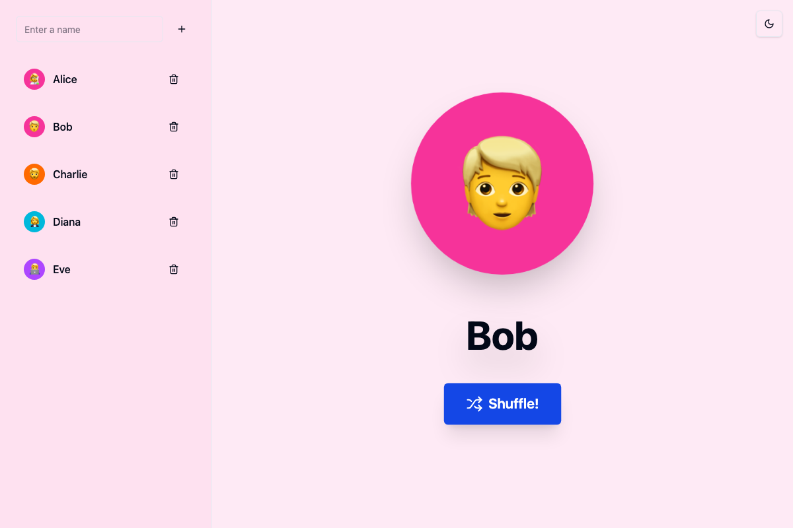

# Name Shuffle App 🎲

[](https://github.com/dprevite/name-picker/actions/workflows/release.yml)
[](https://github.com/dprevite/name-picker/pkgs/container/name-picker)
[](https://opensource.org/licenses/MIT)
[](https://typescriptlang.org)

A beautiful, interactive web application for randomly selecting names with dynamic animations and persistent storage. Perfect for classrooms, team activities, and any scenario requiring fair random selection.

## 📸 Screenshots

### Main Interface

*Clean two-column layout with names list and shuffle area*

### Shuffle Animation & Results
 
*Dynamic shuffle animation (left) and selection results with color theming (right)*

## ✨ Key Features

- **🎨 Visual Identity**: Each person gets a unique color and emoji combination
- **🔄 Dynamic Animations**: Engaging shuffle sequence that cycles through all icons
- **💾 Persistent Storage**: Names automatically saved in browser localStorage
- **🎯 Chevron Display**: Selected names appear elegantly below their avatar
- **🌈 Color Theming**: Background subtly matches selected person's color
- **📱 Responsive Design**: Seamless experience across all device sizes
- **🌙 Theme Support**: Light/dark mode toggle with system preference detection

## 🚀 Quick Start

### Option 1: Docker (Recommended)
```bash
# Run the latest release
docker run -p 8080:80 ghcr.io/dprevite/name-picker:latest
```
Visit http://localhost:8080

### Option 2: Docker Compose
Create `docker-compose.yml`:
```yaml
version: '3.8'
services:
  name-shuffle:
    image: ghcr.io/dprevite/name-picker:latest
    ports:
      - "8080:80"
    restart: unless-stopped
    healthcheck:
      test: ["CMD", "curl", "-f", "http://localhost/"]
      interval: 30s
      timeout: 10s
      retries: 3
```

Run with: `docker-compose up -d`

### Option 3: Local Development
```bash
git clone https://github.com/dprevite/name-picker.git
cd name-picker
npm install
npm run dev
```

## 🛠️ Tech Stack

- **React 19** - Latest React with modern hooks
- **TypeScript** - Full type safety throughout
- **Tailwind CSS 4** - Utility-first styling with custom animations
- **shadcn/ui** - High-quality, accessible components
- **Vite 7** - Lightning-fast build tool
- **Vitest 3** - Modern testing framework
- **Playwright** - End-to-end testing
- **ESLint + Prettier** - Code quality and formatting

## 🔄 Development Workflow

### Scripts
```bash
npm run dev          # Start development server
npm run build        # Build for production
npm run test         # Run unit tests
npm run test:e2e     # Run Playwright tests
npm run lint         # Lint codebase
npm run typecheck    # TypeScript validation
npm run format       # Format with Prettier
```

### Code Quality
- **Linting**: ESLint with React and TypeScript rules
- **Formatting**: Prettier with consistent configuration
- **Testing**: Comprehensive test coverage with Vitest and Playwright
- **Type Safety**: Strict TypeScript configuration

## 🐳 Docker & Deployment

### Multi-platform Support
Images built for `linux/amd64` and `linux/arm64` architectures.

### Available Tags
- `latest` - Latest stable release
- `v1.2.3` - Specific semantic versions
- `1` - Latest major version 1
- `1.2` - Latest minor version 1.2.x

### Production Features
- **Multi-stage Build**: Optimized ~25MB final image
- **Nginx Serving**: Production-ready with caching and compression
- **Health Checks**: Container monitoring built-in
- **Security Headers**: Basic security measures included

## 🔄 Automated Releases

This project uses **semantic versioning** with automated releases:

- `feat:` commits → Minor version bump (1.0.0 → 1.1.0)
- `fix:` commits → Patch version bump (1.0.0 → 1.0.1)
- `BREAKING CHANGE:` → Major version bump (1.0.0 → 2.0.0)

Each release automatically:
- ✅ Runs all tests and quality checks
- 🐳 Builds and publishes Docker images
- 📝 Generates changelog from commit messages
- 🏷️ Creates GitHub release with semantic versioning

See [releases documentation](docs/releases.md) for details.

## 📋 Usage

1. **Add Names**: Enter names using the input field (Enter key supported)
2. **Manage List**: Remove names with trash icon, view all added names
3. **Shuffle**: Click "Shuffle!" to start the random selection animation
4. **Enjoy**: Watch as icons cycle rapidly before revealing the chosen person
5. **Visual Feedback**: Notice the subtle background color change matching the selection

### Animation Features
- **Icon Cycling**: Rapidly displays all user icons mixed with emoji set
- **Smooth Transitions**: 500ms color transitions for theme changes
- **Chevron Display**: Selected name appears below avatar like a badge
- **Bounce Animation**: Selected person bounces in with scaling effect

## 🤝 Contributing

### Commit Format
We use [Conventional Commits](https://conventionalcommits.org/):
```bash
git commit -m "feat: add new shuffle animation"
git commit -m "fix: resolve localStorage edge case"
git commit -m "docs: update installation guide"
```

### Development Setup
1. Fork the repository
2. Create feature branch: `git checkout -b feat/amazing-feature`
3. Make changes with proper commit messages
4. Run tests: `npm test && npm run test:e2e`
5. Submit pull request

### Code Style
- Follow existing TypeScript patterns
- Use provided ESLint/Prettier configuration
- Write tests for new features
- Update documentation as needed

## 📄 License

MIT License - see [LICENSE](LICENSE) file for details.

---

**Live Demo**: Deploy your own instance with one command using the Docker instructions above!